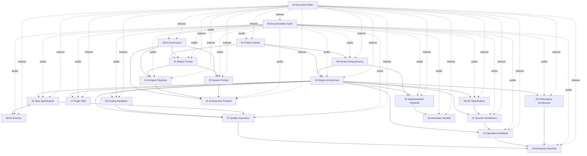

# Documentation Index

## Purpose

This index is the navigation and maintenance reference for the repository’s documentation. It records the purpose, audience, current status, dependencies, and review cadence of each document. It does not supersede approved product, architecture, security, or governance decisions.

## Repository Loading Order

Load documents in this order for a task that affects implementation. Read only the documents relevant to the requested scope after the core context has been established.

1. `00_DOCUMENT_INDEX.md` — navigate the documentation set and identify applicable sources.
2. `00_PROJECT_CHARTER.md` — confirm mission, scope, and project direction.
3. `09_PRODUCT_REQUIREMENTS_DOCUMENT.md` — confirm product intent and constraints.
4. `99_DOCUMENTATION_AUDIT.md` — note known gaps, conflicts, and remediation guidance.
5. `04_ENGINE_ARCHITECTURE.md` — identify component boundaries and dependencies.
6. `02_DATA_SPECIFICATION.md` and `JSON_SCHEMA.md` — confirm data rules and contracts.
7. `05_CODING_STANDARDS.md`, `06_API_SPECIFICATION.md`, `07_QUALITY_ASSURANCE.md`, and `11_SECURITY_ARCHITECTURE.md` — apply implementation controls.
8. `08_AI_GOVERNANCE.md`, `10_IMPLEMENTATION_PLAYBOOK.md`, `12_OPERATIONS_RUNBOOK.md`, `17_PLUGIN_SDK.md`, and `18_PERFORMANCE_ARCHITECTURE.md` — read when the task touches their domain.
9. `15_AI_AGENT_PLAYBOOK.md`, `20_SYSTEM_PROMPT.md`, and `21_AI_EXECUTION_PROTOCOL.md` — consult as legacy AI workflow guidance until consolidated; resolve conflicts through user approval and the documented priority below.
10. `16_DEVELOPER_HANDOFF.md` and `19_ENTERPRISE_CHECKLIST.md` — use for current-state handoff and release readiness, after verifying their content is current.

## Documentation Priority

When instructions conflict, use this order until a formal governance process replaces it:

1. User-approved decisions and task instructions.
2. Security, data-protection, and legal/compliance requirements.
3. Approved product requirements and architecture decisions: `00_PROJECT_CHARTER.md`, `09_PRODUCT_REQUIREMENTS_DOCUMENT.md`, `04_ENGINE_ARCHITECTURE.md`, `02_DATA_SPECIFICATION.md`, and `JSON_SCHEMA.md`.
4. Domain controls: coding, API, QA, AI governance, operations, plugins, and performance documents.
5. Plans, handoff material, checklists, and legacy AI workflow prompts.
6. This index and the audit, which are navigational and advisory.

`20_SYSTEM_PROMPT.md` asserts universal precedence, but the audit identifies this as an unresolved conflict. It must not override user instructions or applicable security and data requirements.

## Document Register

**Agent legend:** All = any agent working in the repository; Arch = architecture/design; Dev = implementation; Data = data/schema; QA = testing/review; Sec = security; Ops = deployment/operations; AI = AI-agent orchestration; PM = product/project management; Ext = plugin/integration development.

| File | Purpose | Primary readers | Dependencies / cross references | Current status | Update frequency |
|---|---|---|---|---|---|
| `00_DOCUMENT_INDEX.md` | Navigation, loading order, priority, and maintenance map. | All | References every document in this register. | Current; newly created. | Update whenever a document is added, removed, renamed, or reprioritized. |
| `00_PROJECT_CHARTER.md` | Project mission, goals, high-level architecture, phases, and success criteria. | All, PM, Arch | Feeds PRD, architecture, and implementation playbook; references the documentation hierarchy. | Approved, but hierarchy contains stale filename references. | At major scope or governance changes; review quarterly. |
| `01_MASTER_PROMPT.md` | Broad legacy AI instruction and platform blueprint. | AI, Arch, Dev | Duplicates architecture, data, quality, governance, and workflow guidance. | Production-ready/frozen claim; audit recommends merge. | Freeze changes; review during AI-policy consolidation. |
| `02_DATA_SPECIFICATION.md` | Data ownership, datasets, validation, knowledge/context lifecycle, and data governance. | Data, Dev, Arch, AI, Sec | Depends on the charter; pairs with `JSON_SCHEMA.md`; informs architecture, QA, and API contracts. | Production-ready/frozen claim; substantive but needs governance detail. | When data contracts, sources, or lifecycle rules change; review per release. |
| `04_ENGINE_ARCHITECTURE.md` | Engine boundaries, layers, eventing, plugins, runtime, and platform concepts. | Arch, Dev, QA, Ops, Ext | Depends on charter/PRD/data; informs API, plugins, QA, security, operations, and performance. | Production-ready claim; needs diagrams and concrete interfaces. | On approved architecture decisions; review each major release. |
| `05_CODING_STANDARDS.md` | Code style, module conventions, errors, logging, performance, and AI code-generation practices. | Dev, QA, AI, Arch | Depends on architecture/security; cross-references QA and AI workflow rules. | Production-ready claim; requires tooling and command specifics. | At stack/tooling changes; review quarterly. |
| `06_API_SPECIFICATION.md` | API principles, internal contracts, response/error/event models. | Dev, Arch, QA, Sec, Ext | Depends on architecture and data/schema; aligns with security and plugin events. | Production-ready claim; audit recommends rewrite for concrete contracts. | On any API/event/version change; review each release. |
| `07_QUALITY_ASSURANCE.md` | Quality gates, unit tests, AI-output validation, and publish checks. | QA, Dev, AI, Arch | Depends on requirements, architecture, coding standards, security, and API contracts. | Production-ready claim; needs executable CI/test strategy. | Each release and when acceptance criteria change. |
| `08_AI_GOVERNANCE.md` | AI permissions, approval levels, confidence, consensus, memory, and audit expectations. | AI, PM, Sec, QA, Arch | Depends on product/data/security; overlaps legacy AI workflow documents. | Production-ready claim; needs enforceable controls. | On model, provider, or policy changes; review quarterly. |
| `09_PRODUCT_REQUIREMENTS_DOCUMENT.md` | Product vision, users, features, non-goals, and success measures. | PM, All, Arch, Dev, QA | Depends on charter; informs architecture, implementation plan, QA, and operations. | Product-definition status; audit recommends rewrite with prioritized requirements. | At roadmap/scope changes; review each planning cycle. |
| `10_IMPLEMENTATION_PLAYBOOK.md` | Phased implementation, release, rollback, and change-management sequence. | Dev, PM, QA, Ops, AI | Depends on charter, PRD, architecture, and standards; informs handoff/checklist. | Approved claim; phases conflict with charter and current repository state. | At phase transitions; review monthly during delivery. |
| `11_SECURITY_ARCHITECTURE.md` | Security principles, access, secrets, validation, data protection, and security events. | Sec, Dev, Arch, Ops, QA, AI | Depends on architecture/data/API; constrains coding, QA, operations, and plugins. | Production-ready claim; audit recommends rewrite with threat model and controls. | On threat, provider, architecture, or compliance changes; review quarterly. |
| `12_OPERATIONS_RUNBOOK.md` | Environments, deployment, incidents, backup/recovery, maintenance, and change management. | Ops, Dev, Sec, QA | Depends on architecture, security, QA, and implementation/deployment choices. | Production-ready claim; needs executable procedures and ownership. | After every operational change; review quarterly and after incidents. |
| `15_AI_AGENT_PLAYBOOK.md` | Legacy AI-agent workflow, loading order, review, and approval behavior. | AI | Depends on charter, PRD, architecture, standards, and governance; duplicates `20`/`21`. | Mandatory claim; audit recommends merge. | Freeze changes; update only within AI-policy consolidation. |
| `16_DEVELOPER_HANDOFF.md` | Current-state handoff for progress, risks, defects, releases, and next work. | Dev, QA, Ops, AI, PM | Depends on actual delivery state and implementation playbook; supports AI session recovery. | Living template; currently not a verified project record. | Update at every handoff, release, or material state change. |
| `17_PLUGIN_SDK.md` | Plugin lifecycle, permissions, events, isolation, compatibility, and health expectations. | Ext, Dev, Arch, Sec, QA | Depends on architecture, API, security, QA, and operations. | Production-ready claim; audit recommends rewrite with formal contracts. | On plugin API/permission/version changes; review each release. |
| `18_PERFORMANCE_ARCHITECTURE.md` | Intended performance concerns and optimization topics. | Arch, Dev, QA, Ops | Depends on architecture; should inform coding, QA, and operations. | Skeletal; audit recommends rewrite. | Establish before performance work; review per release. |
| `19_ENTERPRISE_CHECKLIST.md` | Intended release/readiness checklist. | QA, PM, Ops, Sec, Dev | Depends on all control documents and release evidence. | Skeletal; audit recommends rewrite. | Before every release and after control changes. |
| `20_SYSTEM_PROMPT.md` | Legacy high-priority AI operating instruction. | AI | References charter, PRD, architecture, data/schema, standards, QA, governance, operations, and AI playbooks. | Priority claim is unresolved; audit recommends merge and reference repair. | Freeze changes; update only within AI-policy consolidation. |
| `21_AI_EXECUTION_PROTOCOL.md` | Compact legacy AI task workflow and handoff checklist. | AI | Depends on the same core context as `15` and `20`; duplicates them. | Mandatory claim; audit recommends merge. | Freeze changes; update only within AI-policy consolidation. |
| `99_DOCUMENTATION_AUDIT.md` | Per-document quality audit, conflicts, and remediation priorities. | All, PM, Arch | Depends on all pre-existing documentation; informs this index and remediation planning. | Current audit snapshot. | Re-run after major documentation consolidation or quarterly. |
| `JSON_SCHEMA.md` | JSON data/schema conventions and intended object contracts. | Data, Dev, QA, Arch, AI, Ext | Depends on data specification; informs API, engine architecture, QA, and plugin contracts. | Production-ready/frozen claim; filename conflicts with references to `03_JSON_SCHEMA.md`. | On schema/version/compatibility changes; review every data-contract release. |

## Cross-Reference Rules

- Treat `02_DATA_SPECIFICATION.md` as the narrative data-governance source and `JSON_SCHEMA.md` as the contract source. Do not duplicate field definitions across both without a canonical-reference note.
- Treat `04_ENGINE_ARCHITECTURE.md` as the component-boundary source; `06_API_SPECIFICATION.md` and `17_PLUGIN_SDK.md` must define interfaces consistent with it.
- Treat `07_QUALITY_ASSURANCE.md`, `11_SECURITY_ARCHITECTURE.md`, `12_OPERATIONS_RUNBOOK.md`, and `18_PERFORMANCE_ARCHITECTURE.md` as domain controls applied to architecture and delivery.
- Resolve the duplicated AI workflow material in `01`, `15`, `20`, and `21` before treating any one of them as authoritative.
- References to `03_JSON_SCHEMA.md` mean `JSON_SCHEMA.md` only as a temporary interpretation; correct the source references through an approved documentation-maintenance change. `13_PRODUCT_ROADMAP.md` and `14_ARCHITECTURE_DECISION_RECORDS.md` are currently absent and must not be assumed to exist.

## Mermaid Dependency Diagram

